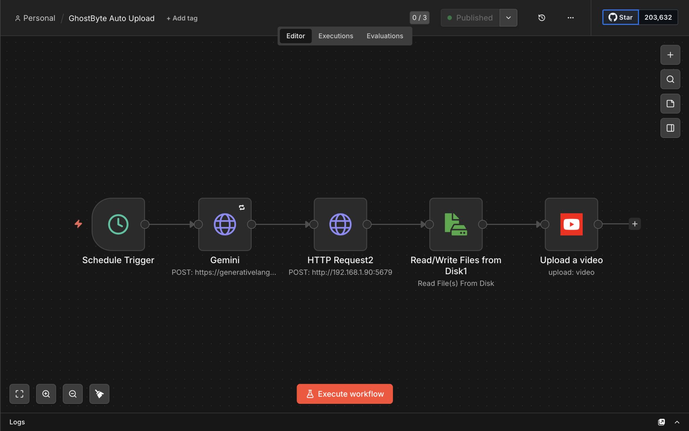

# GhostByte

Fully automated pipeline that generates and uploads YouTube Shorts on a schedule, no manual input.

Every 3 hours it picks a topic, writes a script, renders a video, and uploads it to YouTube. It runs unattended.

## How it works

1. **Schedule Trigger** fires every 3 hours
2. **Gemini** generates a title, a script (under 60 seconds spoken), and search keywords for a randomly rotated topic — space facts, psychology, history, money, food science, and a dozen others
3. **HTTP Request2** sends the script and keywords to a local render service that builds the video (voiceover + matching stock footage, cut and assembled)
4. **Read/Write Files from Disk** picks up the rendered video file
5. **Upload a video** pushes it straight to YouTube via the Data API

## Stack

- n8n (self-hosted, Docker)
- Google Gemini (script + keyword generation)
- Local render service (voiceover + footage assembly)
- YouTube Data API (upload)

## Running it

Import `workflows/GhostByte Auto Upload.json` into your own n8n instance. You'll need:

- A Google Gemini API key
- A render service reachable from n8n (this one points at a local network address — swap it for wherever yours runs)
- YouTube Data API OAuth credentials

## Notes

- Docker needs `-v /tmp:/data` mounted for shared file access between nodes
- `NODE_FUNCTION_ALLOW_BUILTIN=crypto` must be set as an env var for HMAC signing to work
- Gemini sometimes wraps its JSON response in markdown code fences — the workflow strips those before parsing
